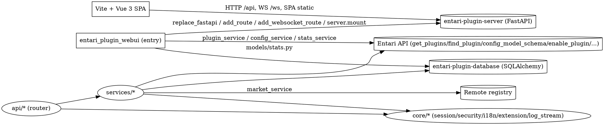

# Entari Plugin WebUI 重设计稿

> 日期：2026-06-30
> 状态：草案 / 待评审
> 参考：
> - 原始仓库功能：`/mnt/d/Projects/entari-plugin-webui`（Nuxt 3 + Naive UI + 手写 JWT 的旧实现，仅作功能参考）
> - Entari 插件/配置 API：`/mnt/d/Projects/Entari/plugin_and_config_api.md`

---

## 0. 背景与目标

原始 `entari-plugin-webui` 0.2.0 已实现仪表盘统计、插件管理、市场、配置编辑、实时日志、JWT 认证与扩展 API。但存在若干架构债：

- 前端基于 Nuxt 3 + Naive UI，构建产物复杂（`nuxt generate` 输出多份 `index.html`），SPA fallback 逻辑脆弱。
- 插件配置页（原版使用一套简单的类型驱动表单）与 entari.yml 配置页（原版使用完整的 JSON-Schema 递归表单）**两套不一致的表单实现**。
- 认证为手写 HS256 JWT + 非持久化 secret（重启即全部失效），WebSocket 与扩展 WS 路由均未受鉴权保护。
- 扩展 API 收集了 WS 路由却从未挂载；只能注册菜单与 HTTP 路由，缺少 i18n、权限、页面组件等能力。
- 市场目录为静态 JSON，难以更新；路由组织零散，每条路由各自注册，缺少 service 层抽象。
- 没有任何测试。

本次重设计在**完全新建的仓库**中从零开始重写，只参考原版提出的功能范围，引用 Entari 提供的 API，重新设计架构与实现。

---

## 1. 技术栈与产物

| 层 | 选择 | 说明 |
|----|------|------|
| 后端 | Python ≥ 3.10 + `entari-plugin-server`（FastAPI 集成）+ `entari-plugin-database`（SQLAlchemy） | 复用原后端集成方式，重新分层组织。 |
| 前端 | Vite + Vue 3 + Element Plus + Pinia + vue-router + ECharts + Monaco Editor + vue-i18n | 离开 Nuxt，改为纯 Vite SPA；Element Plus 替换 Naive UI。 |
| DB | SQLite（`aiosqlite` 驱动，复用 `entari_plugin_database`） | 仅持久化消息计数。日志走内存 ring buffer。 |
| i18n | 仅中文（zh-CN），但全部文案 key 化（vue-i18n） | 为扩展 API 注入词条预留基础。 |
| 主题 | Element Plus 明暗双主题切换 | 主色定调，不开放自定义。 |

### 1.1 前后端衔接

- `vite build` 产物输出到 `src/entari_plugin_webui/static/frontend/`。
- 后端通过 `server.mount` 挂载 `/assets`（前端静态资源）；`GET /` 返回 `index.html`，`GET /{path:path}` 做 SPA fallback（跳过 `api/`、`ws/` 前缀交给真实路由）。
- 开发期 `vite.config.ts` 代理 `/api` 与 `/ws` 到本地后端（默认 `127.0.0.1:5150`）。

---

## 2. 后端模块结构

```
src/entari_plugin_webui/
├── __init__.py            # 插件元数据、生命周期、server wiring、统计监听
├── config.py              # 插件自身配置模型
├── api/
│   ├── deps.py            # 共享依赖：get_session/require_auth/get_locale/csrf_guard
│   ├── auth.py            # /api/auth/*
│   ├── plugins.py         # /api/plugins/*
│   ├── config.py          # /api/config/*
│   ├── stats.py           # /api/stats/*
│   ├── market.py          # /api/market/*、/api/market/tasks/{id}
│   ├── logs.py            # /ws/logs（WebSocket）
│   └── router.py          # 聚合 APIRouter，统一 /api 前缀注入 server app
├── core/
│   ├── session.py         # SessionStore（内存）+ Cookie 中间件 + 滑动续期
│   ├── security.py        # 本地/远程判定 + PBKDF2 密码哈希 + CSRF 守卫
│   ├── i18n.py            # I18nRegistry（合并扩展词条）/ get_locale
│   ├── permissions.py     # 扩展路由权限校验（标识注册）
│   ├── extension.py       # WebUIExtension 注册中心（menus/http/ws/i18n/pages/perms）
│   └── log_stream.py      # LogRingBuffer + LogWriter（loguru sink）
├── services/
│   ├── plugin_service.py  # 封装 Entari 插件 API（list/toggle/reload/config 读写）
│   ├── config_service.py  # entari.yml 段读写 + JSON Schema 生成
│   ├── stats_service.py   # 消息统计（DB）+ 运行时长
│   └── market_service.py  # registry 拉取 + 缓存回退 + pip 安装任务
├── models/
│   └── stats.py           # MessageStat 表
└── static/
    ├── frontend/          # 前端构建产物（SPA）
    └── marketplace.json   # 远程 registry 失败时的本地回退目录
```

### 2.1 分层原则

- **路由薄、逻辑入 service**：`api/*` 只做参数解析、鉴权声明、调用 service、返回结构化响应；所有业务逻辑下沉到 `services/*`，便于单测。
- **依赖注入**：共享能力（会话、locale、鉴权守卫、CSRF 守卫）通过 FastAPI `Depends` 注入；`require_auth` 在本地模式放行、远程模式校验会话。
- **统一响应**：成功 `{success: true, data?, ...}`，失败由中间件包装为 `APIError{code, message, detail?}`，HTTP 状态码语义化（400/401/403/404/409/500）。
- **路由组织**：声明 `APIRouter(prefix="/api")`，各子模块用 `APIRouter(prefix="/...")` 聚合后由 `api/router.py` 合并后通过 `replace_fastapi` 挂到 server app；WS 走 `add_websocket_route`。

---

## 3. 插件自身配置（`config.py`）

```python
class Config(BasicConfModel):
    password: str = ""              # PBKDF2 哈希的管理员密码（远程模式首次启动自动生成）
    registry_url: str = ""           # 远程插件市场目录；空表示禁用远程拉取，仅回退本地缓存
    session_ttl: int = 43200         # 会话存活时长（秒），默认 12h，滑动续期
    log_buffer_lines: int = 5000    # 日志环形缓冲区行数
    login_rate_limit: str = "5/60s" # 登录失败节流（次数/窗口），按 IP
```

通过 `webui_config = plugin_config(Config, bind=True)` 获取可写入即持久化的视图，并以 `config=Config` 挂到插件元数据。

> **registry_url 默认空**：避免占位域名导致生产首启失败。空值时 `market_service` 跳过远程拉取、只读本地 `static/marketplace.json` 缓存；启动时若 `registry_url` 为空或不可达，日志输出 WARNING 明确告知"市场目录不可用"。

---

## 4. 认证：服务端 Session + Cookie

替换原版手写 JWT 方案，改为服务端会话。

### 4.1 会话存储

`core/session.py`：

- `SessionStore`：内存 `dict[sid -> Session{ip, created_at, last_seen, expires_at}]`。会话初始 `ip` 来自登录请求客户端 IP（供审计日志使用）。
- `sid`：`secrets.token_urlsafe(24)`。
- TTL 默认 12h（取 `webui_config.session_ttl`），滑动续期——每次命中 `require_auth` 且剩余 < 1/3 TTL 时刷新 `expires_at`。
- 过期惰性清理 + 启动时清理；不纳入持久化（重启即登出所有会话，可接受）。

### 4.2 Cookie

- 名 `webui_sid`，HttpOnly，SameSite=Lax，HTTPS 下 Secure。
- 登录成功 → 建会话 → `Set-Cookie`；登出 → 删会话 + 清 Cookie。
- 本地模式中间件直接放行，不颁发 Cookie。

### 4.3 本地 / 远程判定

`core/security.py::is_local_deployment(host)`：`host` 为 `None` 或 `127.0.0.1`/`localhost`/`::1` 视为本地；其余为远程。启动时读取 `server.host` 调用 `set_local_mode(bool)` 写入模块全局态。

### 4.4 密码

- PBKDF2-HMAC-SHA256，100 000 轮，16 字节随机 salt。存储格式采用 passlib 风格：`pbkdf2_sha256$100000$<b64salt>$<b64hash>`，便于与未来引入的 `passlib`/`argon2` 升级互换。
- 远程模式首次启动若 `webui_config.password` 为空，生成 16 字符随机口令，哈希后写回，明文输出到日志（WARNING 级别）。
- `PUT /api/auth/password` 远程模式校验旧密码、限制新口令长度 ≥ 6；本地模式跳过旧密码校验但仍写回新哈希（便于切换部署模式）。
- **密码丢失恢复**：无需新增 CLI 标志；管理员可直接编辑 `entari.yml` 把 `plugins.webui.password` 改为空字符串，重启后远程模式会重新生成随机口令并日志输出。该流程写入 README「故障恢复」一节。因为本插件嵌入 entari 进程而非独立 CLI，不提供 `--reset-admin`。

### 4.5 登录节流（暴力破解防护）

`core/security.py::LoginThrottle`：
- 基于 `webui_config.login_rate_limit`（默认 `5/60s`）按客户端 IP 计数失败登录尝试。
- 命中限制后 429 响应，`Retry-After` 头给出剩余秒数。
- 仅失败计数；成功登录清零该 IP 计数。
- 计数表内存态，启动时清空。

### 4.6 CSRF 守卫

远程模式对非安全方法（POST/PUT/PATCH/DELETE）校验：请求须携带 `X-Requested-With` 头（或同源 `Origin`/`Referer`），否则 403。前端通过 axios 默认头注入。

### 4.7 鉴权依赖

```python
def require_auth(request: Request, session: SessionStore = Depends(...)) -> Session | None:
    if is_local_mode():
        return None
    sid = request.cookies.get("webui_sid")
    s = session.get(sid)
    if not s or s.expired:
        raise HTTPException(401, "未登录或会话已过期")
    session.refresh_if_needed(s)
    return s
```

WS 端点同样校验 Cookie（远程模式连接时无有效会话即拒绝）。

### 4.8 审计日志

远程模式下记录安全敏感事件到日志（INFO 级别，落入 §8.2 日志流可供前端查看）：
- 登录成功 / 登录失败（含源 IP、是否触发节流）；
- 登出；
- 修改密码；
- 插件启用/禁用/重载；
- 插件安装/卸载任务发起。

格式示例：`[audit] login.success ip=1.2.3.4`、`[audit] login.failed ip=1.2.3.4 reason=wrong_password`。
本地模式不写审计（鉴权已被跳过）。

---

## 5. 扩展 API（保留并增强）

`core/extension.py` 提供 `WebUIExtension`（按插件 id 注册），其他插件通过公开符号 `webui_extend(plugin_id)` 获取。

### 5.1 可注册项

| 类型 | API | 后端用途 | 前端用途 |
|------|-----|----------|----------|
| 菜单 | `add_menu(label_key, icon, path, order, badge_key?, children?)` | `GET /api/menus` 合并返回 | 侧边栏渲染 |
| HTTP 路由 | `add_route(path, methods, handler, permission?)` | `on_startup` 挂载 | 通过扩展面板 RPC 访问 |
| WS 路由 | `add_websocket_route(path, handler, permission?)` | `on_startup` 挂载（修复原版漏挂） | 扩展面板内连接 |
| i18n 词条 | `add_i18n(locale, key, value)` | `I18nRegistry` 合并 | `GET /api/extensions/manifest` 下发 |
| 权限标识 | `add_permission(key, label_key)` | `permissions.py` 校验扩展路由 | 扩展面板按权限可见性控制 |
| 页面定义 | `add_page(key, label_key, icon, component_url, permission?)` | `GET /api/extensions/manifest` 下发 | `<ExtensionPanelHost>` 加载 iframe |

### 5.2 前端扩展页面宿主

- 菜单多出扩展页条目，路由路径 `/ext/{key}`，渲染 `<ExtensionPanelHost>`。
- 宿主以 **iframe 沙箱**（`sandbox="allow-scripts allow-forms"`，不含 `allow-same-origin`）加载扩展提供的 `component_url`（HTML 页面）。
- 宿主与 iframe 通过 **postMessage RPC** 通信，宿主提供受限能力：
  - `webui.api(method, url, body)` —— 代发请求（复用宿主会话 Cookie，避免泄露给跨源 iframe）；
  - `webui.t(key, params)` —— 文案翻译；
  - `webui.user()` —— 当前用户/权限子集；
  - `webui.ws(path)` —— 建立由宿主代理的 WS；
  - `webui.subscribe(event, handler)` —— 订阅宿主广播的事件。
- **会话 Cookie 一律不暴露给 iframe**：无论同源/跨源，扩展页都通过 `webui.api` 代发请求，宿主在主 frame 持有 Cookie。这样即使第三方扩展被部署在同源，也无法通过 `document.cookie` 读取 `webui_sid`。
- **风险须知**：第三方扩展页面虽无 Cookie 访问权，仍可在沙箱内执行任意脚本并经 `webui.api` 调用所有用户可访问的端点。因此 `extension_registry` 应只接受由本机插件（即写入 `entari.yml` 的可信来源）注册的扩展；远程来源的扩展页面不应被同一宿主加载。该约束在 README 注明。

### 5.3 后端清单端点

```
GET /api/extensions/manifest   # 需会话：返回 {menus, pages, i18n:{locale:{key:value}}, permissions:[...]}
```

`on_startup` 中：
1. 遍历 `get_all_extension_routes()` 挂载 HTTP 路由（`add_route(path, methods)(handler)`）；
2. 遍历 WS 路由（原版漏挂的修复点）调用 `add_websocket_route`；
3. 写入扩展 i18n 与权限到 `I18nRegistry`、`PermissionsRegistry`。

---

## 6. 配置编辑：表单 + JSON 双模式

### 6.1 统一 Schema 驱动表单（Element Plus 版）

新写一套递归 JSON-Schema 表单渲染器，**插件配置与 entari.yml 各 section 共用同一套组件**，修复原版两套表单不一致的缺陷：

```
components/schema-form/
  SchemaForm.vue            # 入口：按 schema.properties 渲染字段
  SchemaField.vue           # 单字段分派器（$ref 解析、readOnly、type 分支）
  ObjectField.vue           # 嵌套对象 + additionalProperties
  ArrayField.vue            # 数组（简单类型、oneOf 项、对象项）
  OneOfField.vue            # 联合类型（简单 oneOf / 复杂 oneOf）
  AdditionalPropertiesEditor.vue
```

支持的 JSON Schema 特性：`string/integer/number/boolean/array/object/null`、`enum`、`oneOf/anyOf`、`$ref`（`$defs/`）、`additionalProperties`、`required`、`default`、`readOnly`、`description/title`。

### 6.2 JSON / YAML 双模式

- 同一页签提供「表单」与「代码」两视图，用 **Monaco Editor** 显示 `JSON` 或 `YAML`（按 section 选择）。
- **单向为主、切视图时同步**：当用户离开代码视图切回表单时，对代码内容做 JSON/YAML 解析；解析成功 → 用解析结果替换表单 v-model；解析失败 → 表单进入「代码无效」停态（字段禁用、显示「代码语法错误，无法同步」横幅，不尝试反向合并）。表单 → 代码方向：切到代码视图时以表单 v-model 序列化覆盖代码内容。
- **实时同步规则**：表单编辑不实时改写代码视图内容（避免编辑中代码被覆写）；代码视图编辑期间表单保持上一有效状态或「代码无效」停态，不做实时反解。
- 保存时按 `GET /api/config/{section}/schema` 返回的 JSON Schema 校验，失败时**字段级高亮**并给出错误提示。
- 高级用户可直接在代码视图编辑，保存时同样走校验。

### 6.3 Schema 来源

- `basic`：`config_model_schema(BasicConfig, ref_root="/properties/basic/")`。
- `adapters`：约定数组对象 schema。
- 插件 section：`find_plugin(plugin_id).metadata.config` → `config_model_schema(...)`，并始终注入 `$disable`/`$priority`/`$prefix`/`$filter`/`$static`/`$optional` 元属性。
- 无 config 模型的 section：回退为 `{type: object, additionalProperties: true}`。

---

## 7. 端点清单

| 方法 | 路径 | 鉴权 | 用途 |
|------|------|------|------|
| GET | `/api/health` | 否 | 容器存活/就绪探针：`{status:"ok", uptime_seconds, frontend_built: bool}` |
| GET | `/api/auth/check` | 否 | 返回 `{local_mode, initialized}` |
| POST | `/api/auth/login` | 否 | 远程模式密码登录，建会话写 Cookie |
| POST | `/api/auth/logout` | 是* | 删会话清 Cookie（本地也接受调用） |
| PUT | `/api/auth/password` | 是* | 修改密码 |
| GET | `/api/stats` | 是 | 仪表盘统计 |
| GET | `/api/plugins` | 是 | 加载插件列表 |
| GET | `/api/plugins/{id}` | 是 | 插件元数据与依赖关系 |
| POST | `/api/plugins/{id}/toggle` | 是 | 启用/禁用 |
| POST | `/api/plugins/{id}/reload` | 是 | 热重载（卸载+加载+启用） |
| PUT | `/api/plugins/{id}/config` | 是 | 写插件配置到 `entari.yml` |
| GET | `/api/config` | 是 | 列出 sections（basic/plugins/adapters/plugin_sections） |
| GET | `/api/config/{section}` | 是 | 读取 section 数据 |
| PUT | `/api/config/{section}` | 是 | 写入 section 数据 |
| GET | `/api/config/{section}/schema` | 是 | 返回该 section 的 JSON Schema |
| GET | `/api/market/plugins` | 是 | 远程目录（回退本地缓存） |
| GET | `/api/market/plugins/{name}` | 是 | 单条插件信息 |
| POST | `/api/market/install` | 是 | 启动 `pip install` 异步任务 |
| POST | `/api/market/uninstall` | 是 | 启动 `pip uninstall` 异步任务 |
| GET | `/api/market/tasks/{id}` | 是 | 轮询任务进度 |
| GET | `/api/menus` | 是 | 内置 + 扩展菜单合并 |
| GET | `/api/extensions/manifest` | 是 | 扩展菜单/页面/i18n/权限清单 |
| WS | `/ws/logs` | 是（远程校验 Cookie） | 推送日志（history + 增量） |
| GET | `/` | 否 | `index.html` |
| GET | `/{path:path}` | 否 | SPA fallback（跳过 api/ws） |

远程模式下标 `*` 的端点要求会话；本地模式放行。

---

## 8. 统计与日志

### 8.1 统计（DB）

- `models/stats.py::MessageStat` 表 `webui_message_stat`：`{id, platform, date(YYYY-MM-DD), count}`。单机部署，无 `instance_id`（原版的该字段恒为 0，本设计直接移除）。
- `SendResponse` 监听器对接 Entari 事件：取 `event.account.platform or "unknown"` 作为 `platform`。每次发送按 `(platform, today)` upsert 一行 `count += 1`；异常吞掉不影响主流程。
- `services/stats_service.py`：`today_messages`、`week_messages[7]`（周一~周日）、`total_messages`、`plugins_enabled`、`plugins_total`、`runtime_minutes`；DB 异常回落为 0 / `[0]*7`。

### 8.2 日志（内存 ring buffer）

- `core/log_stream.py::LogRingBuffer(max_lines)`：`max_lines` 取自 `webui_config.log_buffer_lines`（默认 5000，对高频机器人日志更宽裕）。`collections.deque` + 线程锁，记录全局递增 position；`get_recent(n)`、`get_new_since(pos) -> (text, new_pos)`。
- `LogWriter` 作为 loguru sink 在 `on_startup` 注册（带 entari logger 的 filter/format）。
- `/ws/logs` 连接时发送 `{type:"history", data: get_recent(100)}`，随后每 500ms 推送 `{type:"log", data: get_new_since(last_pos)}`；远模式无会话即关闭。
- ANSI → HTML 转换在前端（`AnsiLogViewer` 组件，基于 `ansi-to-html`）。

---

## 9. 插件市场：远程 registry + 本地缓存回退

- `services/market_service.py` 首次请求时：
  1. 从 `webui_config.registry_url` 拉取目录 JSON，写入 `static/marketplace.json` 缓存（过期时间 1h，配置可调）。
  2. 拉取失败回退读取本地缓存 `static/marketplace.json`；缓存不存在则返回空目录并标记 `fallback=true`。
- 每条目录项带 `installed` 标志（运行 `pip list --format=json` 比对）。
- **安装名校验**（防止注册表被篡改/MITM 安装任意包）：`POST /api/market/install` 的 `name` 必须命中当前已加载的目录条目（远程拉取或本地缓存均可）；未命中 → 400 `unknown_plugin`。`pip install` 命令固定以注册表条目声明的分发名（`pip_name` 字段）执行，不接受请求体直接传入任意包名。卸载同理：必须命中已记录为 `installed=true` 的注册表条目。
- 安装/卸载：`POST /api/market/install|uninstall` 启动 `asyncio.create_subprocess_exec` 跑 `pip install -U <pip_name>` / `pip uninstall -y <pip_name>`，任务 `dict[task_id->InstallTask{status,percent,message}]`，前端轮询 `/api/market/tasks/{id}`。
- 不支持 PyPI 之外的来源（与原版一致）。

---

## 10. 前端结构

```
frontend/
├── index.html
├── vite.config.ts          # build.outDir -> ../src/entari_plugin_webui/static/frontend；dev 代理 /api /ws
├── tsconfig.json
├── package.json
└── src/
    ├── main.ts             # Pinia + vue-router + Element Plus + vue-i18n + ECharts 注册
    ├── App.vue
    ├── router/index.ts     # 全局鉴权守卫（localMode 直接放行，否则未登录跳 /login）
    ├── stores/             # auth, theme, menu, plugins, config
    ├── api/                # axios 封装与各资源 client
    ├── composables/        # useApi, useWebSocket, useI18n, useSchemaForm, useBackendHealth
    ├── layouts/
    │   ├── Default.vue     # 侧边栏 + 头部（暗切换 + 管理员菜单/登出）
    │   └── Blank.vue       # 登录页用
    ├── views/
    │   ├── Dashboard.vue   # 统计卡片 + ECharts 周趋势
    │   ├── Login.vue
    │   ├── Plugins.vue     # 列表 + 启用开关 + 重载 + 详情 + 配置抽屉（SchemaForm）
    │   ├── Market.vue      # 卡片网格 + 标签筛选 + 安装任务轮询
    │   ├── Config.vue      # 左 section 菜单 + 右 SchemaForm/Monaco 双模式
    │   ├── Logs.vue        # WebSocket 日志 + ANSI 渲染
    │   └── ExtensionPage.vue
    ├── components/
    │   ├── schema-form/    # 第 6 节所述组件
    │   ├── config/         # DualConfigEditor.vue（表单↔代码切换 + 校验高亮）
    │   ├── plugins/        # PluginCard.vue / PluginDetailModal.vue / ConfigDrawer.vue
    │   ├── market/         # MarketCard.vue / InstallProgress.vue
    │   └── common/         # StatCard.vue / AnsiLogViewer.vue / ThemeToggle.vue
    ├── extension-runtime/
    │   └── ExtensionPanelHost.vue   # iframe + postMessage RPC
    ├── i18n/
    │   └── zh-CN.ts        # 全部文案 key 化
    └── styles/
```

### 10.1 鉴权守卫与 axios

- `router/index.ts` 全局守卫：访问 `checkAuthMode`；`localMode=true` 直接放行；否则未登录（无会话 Cookie / 后端 401）跳 `/login`。
- axios 实例带 `withCredentials: true`；默认头 `X-Requested-With: XMLHttpRequest`（配合 CSRF）。拦截 401 → 跳 `/login`。

### 10.2 主题

- `stores/theme.ts` 持久化 `light/dark` 到 localStorage；`App.vue` 用 Element Plus `dark` 模式 + `html.dark` class 切换。
- 头部 `ThemeToggle` 切换。

### 10.3 配置表单复用

- `Plugins.vue` 的配置抽屉与 `Config.vue` 共用同一 `<DualConfigEditor :schema :data>`，仅 schema 来源不同（前者 `config_model_schema(plugin.metadata.config)`，后者 `GET /api/config/{section}/schema`）。

### 10.4 后端健康心跳与断连切换（`useBackendHealth`）

- `composables/useBackendHealth.ts` 每 **5s** GET `/api/health`（无需会话，本地/远程皆可探）；Connell 成功即视为后端在线，失败（网络错误/超时 2s）记一次 missed。
- 状态机：`online` → 连续 1 次 miss 切 `reconnecting`（轻量横幅「正在连接后端…」，不阻断操作，自动发起一次即时重探）；`reconnecting` → 连续 3 次 miss（约 15s）切 `offline`。
- `offline` 时全局 `<OfflineOverlay>` 全屏遮罩覆盖，提供「手动重连」按钮；移除 axios 自动跳转 /login 行为以免误判会话失效（区分：axios 401 才走登录跳转，网络层失败交给 `useBackendHealth`）。
- `online` 恢复后：若原路由是日志页则自动重连 WS；其余页面静默恢复，不强制刷新数据（用户可手动刷新）。
- 离开 `offline` 状态时 `useBackendHealth` 触发一次 `recovered` 事件，扩展页面面板可订阅以重置自身状态。
- 后端 `/api/health` 返回体含 `frontend_built`；首次部署若 `frontend_built=false`，前端进入 `Building` 引导页提示需先 `pdm run build-frontend`（开发模式 dev server 直连则跳过）。

---

## 11. 数据流与依赖图



---

## 12. 错误处理

- 统一异常中间件：捕获业务异常映射为 `APIError{code, message, detail?}`，HTTP 状态码语义化。
- service 层抛领域异常（`PluginNotFound`、`ConfigSectionNotFound`、`MarketFetchError`、`AuthError`、`PermissionDenied`、`RateLimited`），路由层不捕获交由中间件翻译。
- WS 异常：连接级 try/except，意外断开记日志后关闭；远模式鉴权失败立即 1008 关闭。

### 12.1 DB Schema 初始化

`MessageStat` 表通过 `entari_plugin_database` 的 Base metadata 在 `on_startup` 调用 `Base.metadata.create_all(engine)`（等价 `CREATE TABLE IF NOT EXISTS`）自动建表。不引入 Alembic——单表无迁移负担，未来加表/列再评估。

### 12.2 静态资源缓存与安全头

- 前端构建产物（`/_nuxt/*`、`/assets/*`）文件名带 hash，`server.mount` 后通过自定义路由或中间件补 `Cache-Control: public, max-age=31536000, immutable`；`index.html` 与 `200.html`/`404.html` 发 `Cache-Control: no-cache`。
- 全局中间件注入安全头：`X-Content-Type-Options: nosniff`、`X-Frame-Options: DENY`（扩展面板 iframe 由宿主在自身 origin 内呈现，不被外部 frame 嵌入）、`Referrer-Policy: no-referrer`、`X-XSS-Protection: 0`（现代浏览器无需，明示关闭旧式过滤）。CSP 暂不强制（Monaco 与扩展 iframe 较复杂），后续可配置。

---

## 13. 测试

### 13.1 后端

- `tests/services/`：各 service 单测，mock Entari API 与 DB。
- `tests/api/`：FastAPI `TestClient` 集成测，覆盖：
  - 本地模式免登录全放行；
  - 远程模式：未会话 → 401；密码登录 → 建会话 → 访问放行；登出 → 401；修改密码校验。
  - 插件 toggle/reload/config 读写；
  - config section 读/schema/写/校验失败场景；
  - market 目录回退（远程失败读本地缓存）；
  - 扩展 manifest 聚合；
  - WS logs 历史+增量推送。
- `tests/core/`：SessionStore 过期/续期、PBKDF2 哈希、CSRF 守卫、I18nRegistry 合并、ExtensionRegistry。

### 13.2 前端

- `components/schema-form/` 各类型/嵌套/oneOf/additionalProperties 渲染与回填单测（Vitest + @vue/test-utils）。
- 视图层关键交互冒烟（可选）。

### 13.3 CI

三 job：
- `lint-frontend`：`npm ci && npm run lint`；
- `lint-backend`：`pdm install && ruff check src/` + `pyright src/entari_plugin_webui`（类型检查**强制**，CI 失败即拦截合并）；pyright 配置 `pyproject.toml` 中 `[tool.pyright]`（`typeCheckingMode=standard`、`venvPath`/`venv` 指向 `.venv`）；
- `build`：`npm ci && npm run build` → 复制到 `src/entari_plugin_webui/static/frontend/` → `pdm build` + `pytest`（合并到 build 后段）。

---

## 14. 构建与部署

- `pyproject.toml`：依赖 `arclet-entari[dotenv,reload,yaml]>=0.17.0`、`entari-plugin-server>=0.6.1`、`entari-plugin-database>=0.2.3`、`fastapi>=0.135.1`、`ansi2html>=1.9.2`。
- PDM scripts：`build-frontend`=`cd frontend && npm ci && npm run build`；`build-all`=`build-frontend` + `pdm build`；`dev`=`cd frontend && npm run dev`。
- `Dockerfile`（多阶段）：node 构建前端 → 复制到 `static/frontend/` → python 构建运行时跑 `python -m arclet.entari`。
- `docker-compose.yml`：端口 5150，挂 `entari.yml` 与 `data/`。
- `.gitignore` 忽略 `static/frontend/`、`__pycache__/`、`.venv/`、`node_modules/`、`.nuxt/`（前端虽不再用 Nuxt，路径无感）。

---

## 15. 与原版差异速查

| 维度 | 原版 0.2.0 | 本设计 |
|------|-----------|--------|
| 前端栈 | Nuxt 3 + Naive UI | Vite + Vue 3 + Element Plus |
| 认证 | 手写 JWT（HS256，secret 非持久），WS 无鉴权 | 服务端 Session + Cookie，WS 校验会话，加 CSRF 守卫 |
| 配置编辑 | 两套不一致的表单（插件页类型驱动、配置页 schema 驱动） | 一套统一 SchemaForm + Monaco 双模式 |
| 市场 | 静态 `plugins.json` | 远程 registry + 本地缓存回退 |
| 扩展 API | 菜单 + HTTP 路由；WS 路由漏挂 | 菜单/HTTP/WS/i18n/权限/页面定义；WS 真正挂载；前端 iframe 沙箱 + postMessage RPC |
| 路由组织 | 每路由各自 `@add_route` 装饰 | `APIRouter` 聚合后挂载 service 层注入 |
| 统计存储 | DB（消息计数） | DB（消息计数，同方案） |
| 日志存储 | 内存 ring buffer + loguru sink | 同方案（抽出 `core/log_stream.py`） |
| 测试 | 无 | service + api + core 单测，前端 SchemaForm 单测 |
| 主题 | Naive UI dark/light | Element Plus dark/light |
| i18n | 无 | 仅 zh-CN，全文案 key 化（vue-i18n） |

---

## 16. 待评审事项 / 已知开放点

1. **会话持久化**：当前设计 SessionStore 内存态，重启登出所有会话。是否需要落库以跨重启保持？（默认：否，接受登出代价。）
2. **扩展页面跨源**：iframe 沙箱 + postMessage RPC 的同源/跨源首版范围。首版仅同源；跨源需求待后续。
3. **i18n 范围**：仅内置 zh-CN；若未来需英文，词条 key 已结构化可增量补充。
4. **CSRF 策略**：采用 `X-Requested-With` 头 + 同源校验；若部署在反代导致头丢失，需文档说明。
5. **评审已采纳项**（见 §3/§4/§5/§6/§7/§8/§9/§12/§13.3 修订）：远程 registry 默认空并发警告、登录失败 IP 节流、密码丢失走配置文件恢复路径、双编辑器「代码无效」停态 sync、日志缓冲可配（默认 5000）、审计日志、`/api/health` 健康端点、市场安装按注册表条目校验 `pip_name`、扩展 iframe 一律不暴露会话 Cookie、pyright 强制、`CREATE TABLE IF NOT EXISTS` 建表、静态资源缓存与安全头。

---

## 17. 下一步

用户评审本设计稿后，进入 writing-plans 阶段，产出分阶段实施计划（建议顺序：项目骨架 → 认证 → 插件 service → 配置编辑 → 统计 → 市场 → 日志 → 扩展 API → 前端视图逐页 → 测试与 CI → Docker 构建发布）。